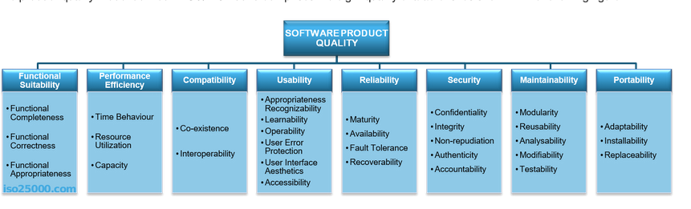
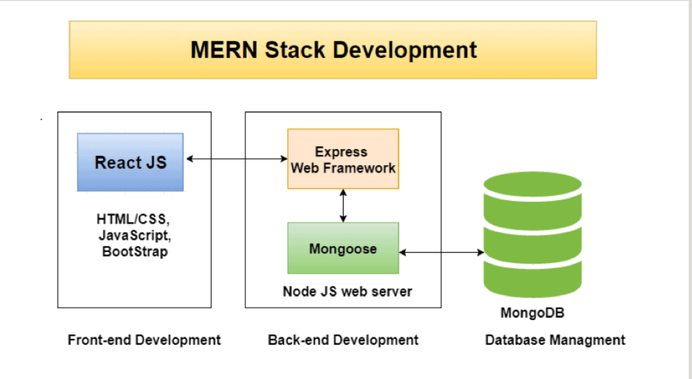

**Author:** [Phil Antiporda](https://github.com/philrussel21)

# Table of Contents

<!-- format: [heading/link name](url) -->

1. [Overview and Description of a standard source control process](https://github.com/philrussel21/t3a1#q1-provide-an-overview-and-description-of-a-standard-source-control-process-for-a-large-project)
1. [Important Aspects of Quality Software](https://github.com/philrussel21/t3a1#q2-what-are-the-most-important-aspects-of-quality-software)
1. [Standard High Level Structure of MERN Stack](https://github.com/philrussel21/t3a1#q3-outline-a-standard-high-level-structure-for-a-mern-stack-application-and-explain-the-components)
1. [Knowledge and Skills of a team to develop a website](https://github.com/philrussel21/t3a1#q4-a-team-is-about-to-engage-in-a-project-developing-a-website-for-a-small-business-what-knowledge-and-skills-would-they-need-in-order-to-develop-the-project)
1. [Knowledge and Skills needed on previous project](https://github.com/philrussel21/t3a1#q5-with-reference-to-one-of-your-own-projects-discuss-what-knowledge-or-skills-were-required-to-complete-your-project-and-to-overcome-challenges)
1. [Previous Project Evaluation]()
1. [Javascript Control Flow](https://github.com/philrussel21/t3a1#q7-explain-control-flow-using-an-example-from-the-javascript-programming-language)
1. [Javascript Type Coercion](https://github.com/philrussel21/t3a1#q8-explain-type-coercion-using-examples-from-the-javascript-programming-language)
1. [Javascript Data Types](https://github.com/philrussel21/t3a1#q9-explain-data-types-using-examples-from-the-javascript-programming-language)
1. [Javascript Array Manipulation](https://github.com/philrussel21/t3a1#q10-explain-how-arrays-can-be-manipulated-in-javascript-using-examples-from-the-javascript-programming-language)
1. [Javascript Object Manipulation](https://github.com/philrussel21/t3a1#q11-explain-how-objects-can-be-manipulated-in-javascript-using-examples-from-the-javascript-programming-language)
1. [Javascript JSON Manilupation](https://github.com/philrussel21/t3a1#q12-explain-how-json-can-be-manipulated-in-javascript-using-examples-from-the-javascript-programming-language)
1. [Code debug, comment and review](https://github.com/philrussel21/t3a1#q13-for-the-code-snippet-provided-below-write-comments-for-each-line-of-code-to-explain-its-functionality-in-your-comments-you-must-demonstrates-your-ability-to-recognise-and-identify-functions-ranges-and-classes)

# T3A1 - Workbook Term 3

[Link to Repo](https://github.com/philrussel21/t3a1)

## Q1 Provide an overview and description of a standard source control process for a large project.

Source control, or as commonly referred to as version control, is by definition the process of tracking and managing the history and changes of the project’s or application’s codebase. It allows going back in time to view source codes at various points of a codebase’s history. Source control systems also make collaborations between teams of developers a lot easier by allowing them to work simultaneously on the same source file and the ability to resolve code conflicts.

For my recent Rails App project, I used Git as the source control system which is an open-sourced distributed source control system that embodies all the above characteristics. This app, with its independent project nature, applies the Feature Branch workflow as its core source control process.

All features of the app took place in a dedicated branch instead of the master branch. This means that the app’s master branch will never contain broken code and would only have tested and working code. This also gave me, as its creator, the opportunity to decide on a feature before it gets integrated into the app’s master branch. It also allowed me to experiment and explore alternative features without ruining the official project.

##### Sources

- [Source 1](https://www.atlassian.com/git/tutorials/comparing-workflows/feature-branch-workflow)
- [Source 2](https://aws.amazon.com/devops/source-control/)

## Q2 What are the most important aspects of quality software?

ISO is an independent, non-governmental international organization that brings together experts to share knowledge and develop voluntary, consensus-based, market relevant International Standards that support innovation and provide solutions to global challenges in the technology industry. ISO has a series of standards also known as SQuaRE (System and Software Quality Requirements and Evaluation) that goals to create a framework to evaluate the quality of a software. These evaluations would be based on the following eight quality characteristics:

- Functional Suitability

  - This characteristic aims to describe the ability of the software to address its purpose. It also covers how the software was able to meet the user's objectives and specifics behind the usage of the software.

- Performance Efficiency

  - The behaviour of the app’s performance relative to the amount of resources used in stated conditions. This involves time consumed during processing and responding, the apps’ usage of its resources and overall capacity of the software to perform its tasks.

- Compatibility

  - The characteristic of the software’s behaviour when used and its resources shared with other softwares to measure its suitability without negative impact to itself and to other softwares.

- Usability

  - Rates the software’s overall usability by its recognizability against other softwares, ease of learning the usage of the software and operating the software while protecting users from making errors. This also includes user’s interaction, their experience when using the software and its accessibility across different variety of devices.

- Reliability

  - This aspect is the software’s ability to have reliable information to serve its purpose.

- Security

  - The characteristic of a software to protect its information, data and the software itself overall.

- Maintainability

  - Ability of the software to be effectively and efficiently modified or improved to correct or to adapt to changes in the environment or its requirements.

- Portability
  - Software’s ability to be transferable from one hardware or operational environment to another without corruption and while maintaining its integrity.

##### Sources

- [Source 1](https://iso25000.com/index.php/en/iso-25000-standards/iso-25010?limit=3&limitstart=0)
  - 
- [Source 2](https://iso25000.com/index.php/en/)

## Q3 Outline a standard high level structure for a MERN stack application and explain the components

MERN Stack is the combination of four technologies MongoDB, Express, React and Node.js. Using these stack, developers are able to create a complete website, both front end and back end, by essentially just using one language: Javascript.

- MongoDB

  - A non-relational and document-oriented database that stores data in collections made out of individual documents. These documents are big JSON blob with no particular format, hence its non-relational nature. Since they are stored as JSONs, manipulating data using Javascript becomes relatively simple and easy.

- Express

  - A web application framework for Node.js that simplifies the development and makes writing secure, modular and fast applications easier. One of its main uses is to create a REST API which then corresponds to a website that will retrieve data via HTTP requests.

- React

  - A Javascript library developed by facebook. It is used to create the front-end part of a website while accelerating its loading speed. It also allows developers to create animations, uploads and other transitions faster.

- Node.js
  - A Javascript runtime environment that allows Javascript code to execute outside a web browser. It uses an event-driven, non-blocking I/O model that makes it efficient specially for data-intensive real-time applications that run across different devices.

How It all fits together:
A web application consists of two parts: the front-end and the back-end.

### Front End

React is used to handle the creation of the overall front end. This would also include the execution of HTTP Requests and Ajax calls to render dynamic data without the need of reloading the page thus improving the overall speed of the app.

### Back End

This side is where the other techs MongoDB, Node.js and Express are used. MongoDB as its database manager, stores the data for the app. These data are created, read, modified and retrieved by the Express framework written in Node.js. These actions are being done in the URLs which are represented by functions with HTTP calls as the originators.

##### Sources

- [Source 1](https://www.bocasay.com/how-does-the-mern-stack-work/)
  

- [Source 2](https://www.bocasay.com/what-is-the-mern-stack/)

## Q4 A team is about to engage in a project, developing a website for a small business. What knowledge and skills would they need in order to develop the project?

Working as a team allows projects to be accomplished more in less time. By taking advantage of the strengths and expertise of different members, the team is able to create a top-notch product to meet the demands of its clients, and in this instance, a website for a small business. Having said that, below is the list of knowledge and skills that are recommended a team should have to achieve this goal.

### Communication Skills

- A team should have effective communication skills both internal and external. Having this skill would enable collaboration between team members. Externally, this would allow liaising with clients about their needs with such ease.

### Product Management

- Understanding the vision and demands of the client is one of the top priorities. Having a skill to liaise with the client and their visions, and to communicate that to the rest of the team is a must have in order to develop a successful product.

### Design, User Interface and User Experience

- Understanding and improving the experience and ‘feel’ of the product is as important as creating the actual product. The skill of product presentation through UI/UX can inspire and intrigue its users thus making a positive impact on the client’s business overall.

### Accessibility

- Nowadays, everything in the world wide web can be accessed across different devices with distinct sizes. A team should have a person with the skill to make a product adaptable to these diverse devices while maintaining its design, UI and UX.

### Security

- The benefits of reaching out in the world wide web as a platform for a business far outweighs the drawbacks it creates. That being said, creating a website exposes a business in a broader range of possible attacks. A team member should have a skill to secure the business’ system and their customer’s privacy and data.

### Testing

- Team members must be aware and knowledgeable of testing their output for potential errors and bugs to meet expected behaviour. Not only does it satisfy clients and produce minimal to bug-free products, it would also be beneficial in collaboration among team members.

### Established Tech Stack

- There are multiple technology stacks a team could use to create a website. What’s important is the team’s ability to translate the specifics and requirements of the product through code. With the nature of the product being a website, a team should atleast have the following knowledge:

  - **HTML**
    - The standard markup language of the web to display documents and data.
  - **CSS**
    - The design aspect of HTML.
  - **Javascript**
    - A very powerful language used to make a dynamic website. Can be used to improve the overall design and behaviour of the product and also to allow transferring and manipulation of data through Node.js
  - **Git**
    - A version-control system to track changes in source code during software development to allow collaboration between team members.
  - **Database**
    - A team should have the knowledge to retrieve, create, read, edit, update and delete data stored in the database. Deciding for a relational or non-relational database would be according to the client’s needs.

##### [Source](https://www.ascendle.com/insight/blog/14-skills-your-app-development-team-must-have/)

## Q5 With reference to one of your own projects, discuss what knowledge or skills were required to complete your project, and to overcome challenges

**Project:** [AirGear MarketPlace](https://airgear-aerospace.herokuapp.com/)

Below is the list of the knowledge and skills I was required to complete this project along with its challenges.

### Tech Skills and Knowledge required along with their challenges

#### HTML

- Focusing on reinforcing semantic html to convey information and reasoning behind each element in a document rather than merely defining its presentation or look.

#### CSS

- Choosing a colour theme to complement each other to define the overall look of the project. Personally, the design aspect is one of my many weaknesses as a developer. To compensate for this weakness, I relied on colour theory to come up with complementing colours. Defining the look of the application on different screen widths proved to be challenging as well and I was able to overcome this challenge by understanding media queries.

#### Javascript and Stimulus Reflex

- At the time of creating this project, I have very little experience with Javascript. I wanted to create a better user experience by implementing a toggle feature in the navigation bar according to the user's screen width. With appropriate research and practice, I was able to achieve this feature.
- One of the key features of this project is the ability to convert a currency to another in real-time. Using Stimulus Reflex, it not only saved me time implementing this feature but also simplified the underlying concept to it as well.

#### Ruby on Rails

- Ruby on Rails is the server-side web application framework used for this project. It was written in Ruby Language.
- Understanding and implementing the MVC architecture of Rails proved to be challenging when deciding which component should handle certain actions and features in accordance with the “Fat Model, Skinny Controller” concept.
- Rails Magic sometimes proved to be overwhelming as it is sometimes unsettling to not know what is happening behind the scenes without checking the Rails Source code. This hurdle was crossed after multiple practice attempts and when the documentation was read.
- A number of Ruby Gems were also needed to make this project possible. One of them is the gem Devise. Devise was easy to implement on its own thanks to their wonderful documentation and easy to follow guide, however, to better accommodate the users of this app, I had to customise Devise and that’s where one of the challenges came up. Research and understanding the documentation helped out to overcome this challenge.

#### HTTP Methods

- Understanding the HTTP actions/methods is vital to a dynamic project. With enough practice and reading, I got comfortable using these methods to manipulate and transfer data from one route to another.

#### Git

- Git is a version-control system to track changes in source code during software development. Mistakes happen and sometimes change of mind is imminent. Having git implemented takes the pain away from these situations by allowing you to go back in time to the desired version of your project.
- The most challenging part about implementing git is to remind myself to commit whenever I made a vital change and to put meaningful commit messages.

#### Deployment to Heroku

- Heroku was one of the recommended cloud platforms to deploy our website to. Understanding error logs was very challenging but fortunately, Heroku has an amazing walk through documentation to guide developers to deploy their website. They also have very helpful fixes to common errors that may come up during deployment.

#### AWS S3

- A service offered by AWS that provides object storage through a web service interface. For this project, AWS S3 was used to remotely store the images uploaded through the app.
- I had some compatibility issues when using S3 to Heroku with regards to access keys. Fortunately, Heroku provided a detailed fix to this issue on their documentation.

### Intangible Skills and Knowledge required along with their challenges

#### Planning and Time Management

- Coming up with this project requires adequate planning. Having a structured plan avoided my chances of being lost during the course of development. It also helped me to stay focused on certain tasks before proceeding to the next.
- Having appropriate time set aside to a certain task promotes task-focus. This skill also allowed me to prioritize more time-consuming features and functionalities thanks to the Trello board I had set up.

#### Researching Skill

- Unfortunately, not everything was handed to me on a silver platter. On some occasions, thorough research to fix an error and find a solution was done to debug a line of code or to implement a key feature. Knowing the proper keywords to search for immensely helped and hastened the process of debugging.

#### Presence of Mind

- As I mentioned before, mistakes happen. There have been plenty of situations during development where I find myself stuck and could not figure out the solution to a certain error. I manage to get over this hurdle by taking a step back, taking a breather to calm down and allow my mind to consider different approaches to solve a problem.

##### [Source](https://github.com/philrussel21/AirGear-Aerospace-marketplace)

## Q6 With reference to one of your own projects, evaluate how effective your knowledge and skills were for this project, and suggest changes or improvements for future projects of a similar nature

## Q7 Explain control flow, using an example from the JavaScript programming language

Control Flow is the ability to act differently based on the information supplied. This fundamental characteristic makes an application dynamic and adaptable.

In Javascript the control flow can be demonstrated in two ways: **Selection** or **Repetition**

### Selection

Selection flow can be further categorised into two: Using If,else if and else or switch case statements.

- If,else if & else

```javascript
const year = 20;
let leapYear = null;
if (year & (100 === 0) && year & (400 !== 0)) {
	leapYear = false;
} else if (year % 4 == 0) {
	leapYear = true;
} else {
	leapYear = false;
}
```

The code above translates to : **if** the year can be divided by 100 exactly and cannot be divided by 400 exactly, then the year is not a leap year. **Else**, **if** the year can be divided exactly by 4 then it is a leap year, **else** (otherwise), the year is not a leap year.

- Switch case
  Swtich cases statements on the other hand allows a program to evaluate an expression and attempt to match the expression’s value to a case label.

```javascript
const mood = ‘tired’
switch (mood) {
  case ‘sleepy’:
    console.log(‘I am sleepy’)
    break
  case ‘tired‘:
    console.log(‘I am tired’)
    break
  default:
  “I am full of energy”
}
```

The code above evaluates the value of the variable mood and tries to match its value to one of the labels followed by the keyword case. If no match is found, the code defaults to the string “I am full of energy”. The break is to put a stop after running the line of code following the matching case statement otherwise the rest of the code would still run, and in this case, would print.

### Repetition

In some cases, we want to control the number of times a certain behaviour runs, hence repetition. A chunk of code will run repeatedly as long as the condition is met or for a certain number of times.
Javascript has several types of loops, namely:

- While loop

```javascript
let count = 5;

while (count > 0) {
	console.log(count);
	count--;
}
```

Continue running the code while the value of count is greater than 0 and each time after printing out the value, reduce the value by one.

- Do...while loop

```javascript
let count = 0;

do {
	console.log(count);
	count++;
} while (count !== 5);
```

Run once before checking if the value of count is not equal to 5. If it is not, then continue running until it is equal to 5.

- For loops

```javascript
for (let i = 0; i < 5; i++) {
	console.log(i);
}
```

For as long as i is less than 5, run the code inside the code block. After every time the code is run, add 1 to the value of i.

##### [Source](https://coderacademy.instructure.com/courses/308/pages/control-structures?module_item_id=15879)

## Q8 Explain type coercion, using examples from the JavaScript programming language

Simply put, type coercion is the process of converting a value from one type to another type. It could be converting a string to a number, an object to a boolean, a number to a string, and so on. Primitive and non-primitive types can be both type coerced. Type coercions can be divided into two categories, explicit and implicit coercion.

Explicit coercion or type casting is when a developer expresses the intention to convert a value from one type to another. The developer achieves this by writing lines of appropriate code. Common examples of this behaviour is as follows:

- **Converting Numbers to Strings**
  - `String(21)`
    - Converts the number 21 to string ‘21’
  - `String(variable)`
    - Given that the variable holds a number value, the method above would return its string value.
- **Converting Strings to Numbers**
  - `Number(‘3.14’)`
    - Converts the string ‘3.14’ to its number value 3.14

On the other hand, implicit coercion is when Javascript tries to operate on a wrong data type. It makes the assumption that this type needs to be changed to another so it automatically converts them. The result of this behaviour might not be what the developer always expects. A common example of this is when the == operator is used.
When using the == operator, if given different data types, javascript would detect that one type is ‘wrong’ so it converts it to match the other type. To prevent this behaviour, Javascript also provides a strict equality operator (===).

##### [Source](https://www.freecodecamp.org/news/js-type-coercion-explained-27ba3d9a2839/)

## Q9 Explain data types, using examples from the JavaScript programming language

Javascript is a dynamically typed language which means variables are not directly associated with any particular type and can also be assigned and reassigned. There are two types of data in Javascript, Primitive and Structural.

### Primitives:

- **String**
  - Common type for words, sentences and on the basic level, letters.
  - `“Hello, world!”` is a String
- **Number**
  - Type for numbers, integers and decimals.
  - `21` is a Number
- **Boolean**
  - Type for `True` or `False`
- **Undefined**
  - Type assigned to a recently declared variable in Javascript where the value is not assigned yet.
  - `var variable;` would be undefined
- **BigInt**
  - Numeric data type that can represent integers in the arbitrary precision format. It is created by appending n to the end of a number literal.
  - `9007199254740991n` is a BigInt
- **Symbol**
  - A data type that represents a unique identifier.
  - `let sym = Symbol()` would create a data type symbol
- **Null**
  - A value that represents an intentionally non-existent or invalid object or value.
  - `let n = null` would create a variable that has a null value in it.

Primitive types can be checked by the typeof operator which returns the value’s type in a string format.

### Structural Types:

- **Object reference**
  - Mutable data types which means that their value can be changed after it gets created.
  - `Objects`, `Arrays`, `Maps`, `Sets`, `WeakMap`, `WeakSet`, and `Date` are all object references.
- **Function**
  - Much like object reference but a non-data structure.
  ```javascript
  function greet(){
      console.log(‘hello, world!’)
  }
  ```
  - typeof greet would return a string `‘function’`

##### Sources

- [Source 1](https://coderacademy.instructure.com/courses/308/pages/datatypes?module_item_id=15878)
- [Source 2](https://developer.mozilla.org/en-US/docs/Web/JavaScript/Data_structures)

## Q10 Explain how arrays can be manipulated in JavaScript, using examples from the JavaScript programming language

Arrays are special data structures that hold other values inside. Values inside an array are indexed and are zero-based, meaning the index of the first element always starts at 0. They are wrapped with square brackets ([]) and contain any other type of data, including another array. Values inside an array are referenced using their index.

These properties and descriptions of an array are pretty common to most programming languages, it only differs on what methods are available to each programming language. Below are different ways and methods of how a Javascript Array can be manipulated.

- `Array.push()`
  - Adds the passed value or values to the end of an array which would change the original array.
- `Array.pop()`
  - Removes and returns the last item of the array.
- `Array.shift()`
  - Removes and returns the first item of an array.
- `Array.unshift()`
  - Adds the passed value or values to the front of an array then returns the new length of the array.
- `Array.splice()`
  - Changes the contents of an array by adding, removing, and inserting values depending on the number of arguments passed to the method.
- `Array.slice()`
  - Extracts and returns a section of the array depending on the passed starting and ending index.
- `Array.filter()`
  - Returns a new array depending on the test or matching criteria set up in the callback.
- `Array.map()`
  - Creates and returns a new array by manipulating the values inside the array defined in the callback function passed.
- `Array.reduce()`
  - Returns a calculated single value from the element in the array based on the callback function passed.
- `Array.forEach()`
  - Iterates through every element in the array and applies the callback on all items.

##### [Source](https://developer.mozilla.org/en-US/docs/Web/JavaScript/Reference/Global_Objects/Array)

## Q11 Explain how objects can be manipulated in JavaScript, using examples from the JavaScript programming language

Objects, much like Arrays, are special data structures that hold different types of data inside of them, including another object. However, instead of having and being referenced using their index, objects are collections of properties(or keys) and their respective values. They are referenced using these keys to extract their values and these key-value pairs are wrapped in curly-braces ({}).

Below are different methods of how objects can be manipulated in the Javascript language.

- `Object.create(obj)`
  - Returns a newly created object using the passed object as the prototype.
- `Object.values(obj)`
  - Used to extract all the values of the passed object. The values are returned as an array.
- `Object.keys(obj)`
  - Used to extract all the keys of the passed object. The keys are returned as an array.
- `Object.entries(obj)`
  - Returns an array that has nested arrays consisting of the key-value pairs of the object passed.
- `Object.assign(obj1, obj2)`
  - Returns a new object with the combined key-value pairs from the first object and the second object.
- `Object.freeze(obj)`
  - Since objects are not primitive data types in Javascript and thus mutable in nature, objects and its elements are allowed to be changed. This method would negate that behaviour by preventing adding of new key-value pairs and would also prohibit modifying existing properties.

##### [Source](https://developer.mozilla.org/en-US/docs/Web/JavaScript/Reference/Global_Objects/Object)

## Q12 Explain how JSON can be manipulated in JavaScript, using examples from the JavaScript programming language.

JSON stands for Javascript Object Notation, a standard text-based format to represent structured data using the syntax of Javascript’s object. Nowadays, it is commonly used as the format to transfer data in web applications like sending some data from the server to the client, or sending the client’s data from the client to the server for storage. Even though JSON has Javascript on its name, it can exist and can be stored in its own file with an extension of .json.

Much like a Javascript object, JSON can store different data types like strings, numbers, arrays, booleans, arrays, and objects. Values can also be extracted from a JSON file depending on its structure, if its an array, using an index, if an object, using its keys.

There are two Javascript methods commonly used when interacting with JSON files. First being able to convert a string (JSON’s format) to an object, and the other does the opposite. These two methods are very useful for transferring and storing data.

- `JSON.parse(jsonFile)`
  - Converts the json text string to an object to fully use javascript’s method of interacting and manipulating the json’s data.
- `JSON.stringify(obj)`
  - Converts the object to a JSON string to be stored or sent.

##### [Source](https://developer.mozilla.org/en-US/docs/Learn/JavaScript/Objects/JSON)

## Q13 For the code snippet provided below, write comments for each line of code to explain its functionality. In your comments you must demonstrates your ability to recognise and identify functions, ranges and classes

```javascript
// creates a Car class object
class Car {
	// this Car class expects a brand upon creation
	constructor(brand) {
		// the car brand provided is then saved as a carname attribute to the instance.
		this.carname = brand;
	}
	// present() is a class instance function that is called on the instance
	present() {
		// this function (or method), when called, would return the string 'I have a ' and the brand name of the instance
		// when it was created.
		return 'I have a ' + this.carname;
	}
}

// creates a Model class object that inherits from Car class, thus inheriting the functions of the Car class
class Model extends Car {
	// upon creating, Model class instance is expected to have a brand and mod passed to it.
	constructor(brand, mod) {
		// refers to the parent class and its attribute thus possessing the same attribute carname inherited
		// from its parent (Car) class
		super(brand);
		// the mod passed upon creation is saved as the instance's .model attribute
		this.model = mod;
	}
	// in addition to the the parent class' (Car) functions, the function (or method) below would also be available to the instances
	// created by this class object.
	show() {
		// the function calls the .present() method originated from Model's parent class which should return a string,
		// in addition to that, the string 'it was made in ' and the instance's model are appended.
		return this.present() + ', it was made in ' + this.model;
	}
}

// creates a variable named makes that holds an array of values
let makes = ['Ford', 'Holden', 'Toyota'];
// two other ways of creating an array is using new Array(arrayLength) constructor and the Array.from(arrayLike, mapFunc)
// new Array(40) would create an array that has a length of 40
// the array created is passed with a function that would fill its index with values (the values of which are from the returned value of the function is in this case is 1980 plus the number of iteration (i))
// thus creating a new array using Array.from()
let models = Array.from(new Array(40), (x, i) => i + 1980);

// a declared function that accepts two arguments, a min number and a max number
function randomIntFromInterval(min, max) {
	// min and max included
	// Math.random() returns a number in between 0 and 1.
	// the difference of max number and min number added by 1 plus the minimum number is then multiplied to the returned number between 0 and 1.
	// finally, it is rounded down to the nearest whole number and is returned out of the function
	return Math.floor(Math.random() * (max - min + 1) + min);
}

// a new ES6 syntax of looping through an array. Commonly known as the for..of syntax and is used mainly with arrays
// iterates on every element in models array and is assigned to the variable model
for (model of models) {
	// using 0 min number and the makes' array length less 1 as its max number, the number returned from this
	// function is then passed as an index to the makes array which should extract the value from the said array
	// and put in the make variable.
	make = makes[randomIntFromInterval(0, makes.length - 1)];
	// almost the same as above except through the models array and its attributes and elements.
	model = models[randomIntFromInterval(0, models.length - 1)];

	// creates a new instance of the Model class using the make varible from above as its brand and model from above as its model
	mycar = new Model(make, model);
	// logs to the console the returned string from invoking the .show() method on the mycar instance declared in the previous line.
	console.log(mycar.show());
}
```
